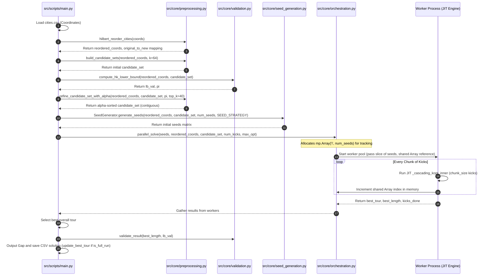

# Detailed Design: Pure Python/Numba TSP Solver

This document describes the detailed design for the 100% pure Python and Numba-accelerated TSP (Traveling Salesperson Problem) core solver. It is derived from [proposal.md](doc/proposal.md) and [high-level-design.md](doc/high-level-design.md).

---

## 1. System Architecture & Core Data Layout

The solver consists of independent, decoupled modules. The main entry point orchestrates the execution flow by loading coordinates, executing reordering and preprocessing, generating starting paths, spawning parallel solver subprocesses, and verifying the quality of the final best tour against the Held-Karp lower bound.

### 1.1 Data Layout & Type System
To eliminate overhead and maximize cache locality, all computations inside the Numba core operate on memory-aligned, contiguous NumPy arrays.

| Data Structure | Variable Name | Shape | NumPy Dtype | Description |
| :--- | :--- | :--- | :--- | :--- |
| **Coordinates** | `coords` | `(N, 2)` | `np.float64` | Physical $(x, y)$ coordinate matrix (Hilbert-reordered). |
| **Coordinate X** | `coords_x` | `(N,)` | `np.float64` | 1D projection of X coordinates (C-contiguous). |
| **Coordinate Y** | `coords_y` | `(N,)` | `np.float64` | 1D projection of Y coordinates (C-contiguous). |
| **Candidate Sets** | `candidate_set` | `(N, K)` | `np.int32` | C-contiguous nearest neighbor index matrix (sorted by Alpha values). |
| **Candidate Distances** | `candidate_dists`| `(N, K)` | `np.float64` | Precomputed distance mapping matching the candidate set. |
| **Path / Tour** | `tour` | `(N,)` | `np.int32` | Array representing the sequence of visited city indices. |
| **Node Positions** | `pos` | `(N,)` | `np.int32` | Lookup array mapping city index to its position in `tour`. |
| **Don't Look Bits** | `dlb` | `(N,)` | `np.bool_` | Active pruning flags (True indicates node search can be skipped). |
| **Held-Karp Pi** | `pi` | `(N,)` | `np.float64` | Node penalty vector computed via subgradient iteration. |

> [!IMPORTANT]
> All array variables entering Numba JIT engines MUST be checked or cast using `np.ascontiguousarray()` to ensure stride-based CPU register optimizations are not degraded by slice copy overheads.

---

## 2. Detailed Module Specifications

### 2.1 Configuration Module (`src/config.py`)
Defines the global parameters as module-level constants.

```python
# src/config.py
K_NEIGHBORS: int = 16            # Initial KDTree neighbor size query
ALPHA_NEIGHBORS: int = 40        # Refined neighbor size sorted by Alpha
OR_OPT_MAX_LEN: int = 5          # Max sequence length for Or-opt segment relocation
SEED_STRATEGY: str = "Hybrid"    # Seeding mode: "Greedy" or "Hybrid" (Greedy + Hilbert)
STAGNATION_LIMIT_FACTOR: float = 0.01  # Stagnation Limit = max(50, N * STAGNATION_LIMIT_FACTOR)
```

---

### 2.2 Preprocessing Module (`src/core/preprocessing.py`)
Responsible for coordinate reordering, initial neighbor generation, and Alpha sorting.

```python
def hilbert_reorder_cities(coords: np.ndarray) -> Tuple[np.ndarray, np.ndarray]:
    """
    Sort coords along the Hilbert curve.
    
    Inputs:
        coords: np.ndarray (shape=(N, 2), dtype=float64) - Original coordinates
    Outputs:
        reordered_coords: np.ndarray (shape=(N, 2), dtype=float64) - Reordered coordinates
        original_to_new: np.ndarray (shape=(N,), dtype=int32) - Map from original index to new index
    """
```
*   **Logic**:
    1. Computes the bounding box of `coords`.
    2. Maps float coordinates to integers in range $[0, 2^{20}-1]$.
    3. Transforms 2D integer coordinates to 1D distances along the space-filling Hilbert curve.
    4. Re-orders coordinates and computes the inverse index mapping.

```python
def build_candidate_sets(coords: np.ndarray, k: int = 16) -> np.ndarray:
    """
    Query k nearest neighbors utilizing scipy.spatial.KDTree. Delaunay triangulation is bypassed.
    
    Inputs:
        coords: np.ndarray (shape=(N, 2), dtype=float64) - Hilbert-reordered coordinates
        k: int - Number of neighbors to collect
    Outputs:
        candidate_set: np.ndarray (shape=(N, k), dtype=int32) - Index mapping of closest neighbors
    """
```

```python
def refine_candidate_set_with_alpha(
    coords: np.ndarray,
    candidate_set: np.ndarray,
    pi: np.ndarray,
    top_k: int = 40
) -> np.ndarray:
    """
    Evaluates edge Alpha values utilizing the HK pi vector, sorts candidates by Alpha, 
    and slices the top_k entries. 
    
    Inputs:
        coords: np.ndarray (shape=(N, 2), dtype=float64)
        candidate_set: np.ndarray (shape=(N, K_orig), dtype=int32)
        pi: np.ndarray (shape=(N,), dtype=float64)
        top_k: int - Number of sorted neighbors to return
    Outputs:
        refined_candidate_set: np.ndarray (shape=(N, top_k), dtype=int32) (C-contiguous)
    """
```
*   **Memory Guarantee**: The output is explicitly wrapped via `np.ascontiguousarray(refined_candidate_set, dtype=np.int32)` before return.

---

### 2.3 Seeding Module (`src/core/seed_generation.py`)
Implements NN tour construction, rotation re-seeding, and features the `SeedGenerator` factory class.

```python
def rotate_tour(tour: np.ndarray, start_node: int) -> np.ndarray:
    """
    Shifts the starting position of the tour cycle to start_node.
    
    Inputs:
        tour: np.ndarray (shape=(N,), dtype=int32)
        start_node: int
    Outputs:
        rotated_tour: np.ndarray (shape=(N,), dtype=int32)
    """
```

#### Seeding Factory Design:
```python
class SeedGenerator:
    @staticmethod
    def generate_seeds(
        coords: np.ndarray,
        candidate_set: np.ndarray,
        num_seeds: int,
        strategy: str = "Greedy"
    ) -> np.ndarray:
        """
        Creates starting paths based on selection.
        - "Greedy": Returns Greedy NN seeds from distinct starting cities.
        - "Hybrid": Returns 50% Greedy NN seeds and 50% Hilbert-curve based seeds.
        
        Inputs:
            coords: np.ndarray (shape=(N, 2), dtype=float64)
            candidate_set: np.ndarray (shape=(N, K), dtype=int32)
            num_seeds: int
            strategy: str (either "Greedy" or "Hybrid")
        Outputs:
            seeds: np.ndarray (shape=(num_seeds, N), dtype=int32)
        """
```

---

### 2.4 Cascading K-Opt Engine (`src/core/kopt_engine.py`)
Implements the local search cascade (`2-opt -> or-opt -> 3-opt`) and perturbation loops. 

> [!WARNING]
> Hard lock constraints (`locked_edges`) have been entirely cleaned and removed from all function signatures and local searches in the engine to eliminate $O(N \cdot k^2)$ overhead.

```python
def cascading_kopt_optimize(
    initial_tour: np.ndarray,
    coords_x: np.ndarray,
    coords_y: np.ndarray,
    candidate_set: np.ndarray,
    num_kicks: int = 500,
    max_opt: int = 3,
    time_limit_s: float = -1.0,
    chunk_size: int = 1,
    progress_array: Optional[Any] = None,
    seed_idx: int = 0,
) -> Tuple[np.ndarray, float, int]:
    """
    Python wrapper executing chunked Numba loops with real-time feedback.
    
    Inputs:
        initial_tour: np.ndarray (shape=(N,), dtype=int32)
        coords_x: np.ndarray (shape=(N,), dtype=float64)
        coords_y: np.ndarray (shape=(N,), dtype=float64)
        candidate_set: np.ndarray (shape=(N, K), dtype=int32)
        num_kicks: int - Total number of ILS perturbation loops
        max_opt: int - Max K-opt depth (default 3)
        time_limit_s: float - Time limit in seconds
        chunk_size: int - Yield control back to Python every chunk_size kicks
        progress_array: multiprocessing.Array ctypes counter
        seed_idx: int - Index used for progress reporting
    Outputs:
        best_tour: np.ndarray (shape=(N,), dtype=int32)
        best_length: float
        kicks_done: int - Exact count of kicks executed
    """
```

#### Core JIT Subroutines:
*   `_optimize_2opt(tour, coords_x, coords_y, candidate_set, candidate_dists, pos, dlb) -> bool`: Runs candidate-guided 2-opt swaps with DLB pruning.
*   `_optimize_or_opt(tour, coords_x, coords_y, candidate_set, candidate_dists, pos, dlb, max_len=OR_OPT_MAX_LEN) -> bool`: Runs segment relocations.
*   `_optimize_3opt_sequential(tour, coords_x, coords_y, candidate_set, candidate_dists, pos, dlb) -> bool`: Executes sequence-guided 3-opt moves.
*   `_full_cascade(...) -> None`: Loops local optimizations sequentially until no improvement is found.
*   `_double_bridge_kick(tour) -> None`: Applies random 4-edge deletion and cross-reconnection.
*   `_cascading_kopt_inner(...) -> Tuple[np.ndarray, np.ndarray, float, int]`: Outer ILS JIT-loop processing `chunk_size` iterations of perturbation and local search.

---

### 2.5 Orchestration Module (`src/core/orchestration.py`)
Manages parallel workers and aggregates results.

```python
def parallel_solve(
    seeds: np.ndarray,
    coords: np.ndarray,
    candidate_set: np.ndarray,
    num_processes: int = -1,
    num_kicks: int = 100,
    max_opt: int = 3,
    time_limit_s: float = -1.0,
    iteration_start_time: float = 0.0,
    total_start_time: float = 0.0
) -> List[Tuple[np.ndarray, float]]:
    """
    Spawns solver workers across CPU cores via multiprocessing.Pool.
    """
```
#### Progress & Communication Details:
1.  **Shared Memory Counters**: Progress tracking utilizes `multiprocessing.Array('i', num_seeds)`. Workers increment their respective cell index directly upon completing each JIT chunk.
2.  **Solver Independence**: Each worker runs completely isolated. Inter-process best tour synchronization is omitted to avoid lock overhead.
3.  **Result Collection**: Results are sent back via `apply_async` return objects.

---

### 2.6 Validation Module (`src/core/validation.py`)
Computes Held-Karp lower bounds and edge Alpha values.

```python
def compute_hk_lower_bound(
    coords: np.ndarray,
    candidate_set: np.ndarray,
    max_iter: int = 500,
    initial_pi: Optional[np.ndarray] = None,
    target_ub: float = np.inf,
    sample_name: Optional[str] = None
) -> Tuple[float, np.ndarray]:
    """
    Computes Held-Karp bound and the Pi vector utilizing subgradient descent.
    
    Inputs:
        coords: np.ndarray (shape=(N, 2), dtype=float64)
        candidate_set: np.ndarray (shape=(N, K), dtype=int32)
        max_iter: int
        initial_pi: Optional[np.ndarray] (shape=(N,), dtype=float64)
        target_ub: float
        sample_name: Optional[str] (triggers load/save file cache)
    Outputs:
        best_lb: float
        best_pi: np.ndarray (shape=(N,), dtype=float64)
    """
```

---

### 2.7 Data I/O & Persistence (`src/utils/data_io.py` & `src/utils/persistence.py`)
Handles CSV updates and file reads.

```python
def load_best_length_from_csv(filepath: str) -> float:
    """Reads a CSV file and parses the best length. Returns np.inf if not found."""

def update_best_tour(filepath: str, tour: np.ndarray, length: float) -> None:
    """Updates the optimal tour on disk if length is an improvement."""
```
*   **Safe Writing Safeguard**: File modifications are skipped during execution if `is_full_run` is evaluated as False, preventing subset solutions from overwriting optimal global solutions.

---

## 3. Key Technical Decisions & Implementation Details

### 3.1 Parameter Passing in Numba (Option A)
To allow testing flexibility without losing Numba compile-time optimizations, parameters are passed as function arguments with default values mapped to global configs:
```python
@njit(fastmath=True, cache=True)
def _optimize_or_opt(
    tour: np.ndarray,
    coords_x: np.ndarray,
    coords_y: np.ndarray,
    candidate_set: np.ndarray,
    candidate_dists: np.ndarray,
    pos: np.ndarray,
    dlb: np.ndarray,
    max_len: int = OR_OPT_MAX_LEN  # Defined in src/config.py
) -> bool:
    ...
```
When compiled, Numba optimizes the default constant-value path (dead-branch elimination, loop unrolling), but unit tests can override this value (e.g. `_optimize_or_opt(..., max_len=2)`) to verify logic.

### 3.2 Locked Edges Parameter Cleanup
All parameters named `locked_edges` are completely removed from solver signatures. The soft backbone strategy relies on pre-sorting candidate lists using Alpha values:
$$\alpha(i, j) = d'(i, j) - \text{mst\_weight\_increment}(i, j)$$
By placing lower Alpha values at the front of each row in `candidate_set`, local searches automatically scan highly promising edges first, resulting in implicit pruning without hard locks.

### 3.3 Multiprocessing Shared Memory Setup
`orchestration.py` uses `multiprocessing.Array('i', num_seeds)` to allocate memory mapped integers on the host:
```python
import multiprocessing as mp

# Inside parallel_solve:
shared_kicks = mp.Array('i', [0] * num_seeds)
```
Each worker receives `shared_kicks` and updating it from inside `_kopt_worker` has minimal serialization overhead compared to Manager proxy calls.

---

## 4. Execution & Orchestration Flow



### 4.1 Orchestration Exception and Timeout Handling
To prevent worker hangs or exceptions (such as Numba signature compile mismatches or MemoryErrors) from deadlocking the pool:
1.  Workers wrap the core optimization call inside a standard `try-except Exception` block.
2.  If an exception occurs or the allocated wall-clock time limit is exceeded, the worker catches the event, logs the error stack to `sys.stderr`, and returns the best tour and length discovered up to that point:
    ```python
    def _kopt_worker(args):
        try:
            # Execute cascading_kopt_optimize
            return cascading_kopt_optimize(...)
        except Exception as e:
            print(f"Worker exception occurred: {e}", file=sys.stderr)
            # Return initial state or best tracking state if accessible
            return initial_tour, initial_length, 0
    ```
3.  The parent process uses `Pool.apply_async` and queries `result.ready()` with a sleep interval. If a global timeout is reached, it terminates the pool using `pool.terminate()`, joins the processes, and aggregates the best intermediate tours.

---

## 5. Hot Path Analysis & Performance Optimization

Calculations executed within K-opt loops are designated as **Hot Paths** and decorated with `@njit(fastmath=True, cache=True)`:

### 5.1 Hot Path Breakdown
1.  **`_dist(c1, c2, coords_x, coords_y)`**: Calculates distance between node indices.
    *   *Optimization*: Inlined inside calling functions (`inline='always'`).
2.  **`_optimize_2opt`**: Sweeps candidate lists for each node to evaluate 2-opt cuts.
    *   *Optimization*: Fastmath allows SIMD vectorization.
3.  **`_optimize_or_opt`**: Relocates path segments of length up to `max_len`.
4.  **`_optimize_3opt_sequential`**: Evaluates 3-edge cut alternatives.
    *   *Optimization*: Employs sub-gradient bounding. If the partial gain of the first cut is negative ($g_1 \le 0$), it prunes subsequent loops early.

### 5.2 Fastmath Safety Analysis
Applying `fastmath=True` is safe and effective because:
*   City coordinates are real numbers; calculations are free from values like NaN or Infinity.
*   Distance calculations do not involve division operations, preventing division-by-zero occurrences.
*   Floating-point reassociations and reciprocal approximations allowed by fastmath accelerate coordinate operations with no impact on the integer indices of the TSP tour path.

---

## 6. Testability & Verification Plan

### 6.1 Unit Test Execution Under Disabling JIT
To verify algorithmic correctness and support step-by-step debugger validation:
*   A pytest fixture or global configuration is added in `tests/conftest.py` that sets:
    ```python
    import os
    os.environ["NUMBA_DISABLE_JIT"] = "1"
    ```
*   This disables Numba compile passes, running JIT functions as raw Python. Key operations, such as `_apply_2opt` and `_reconstruct_tour_3opt`, are fully testable as pure Python functions.

### 6.2 Regression and Scale Verification Plan
All algorithm checks must progress sequentially by scale, checking correct convergence behavior before increasing dataset sizes:

```
[Scale 1: N=100]  ──> Verify K-opt operations and cost decreases
        │
        ▼
[Scale 2: N=500]  ──> Confirm cache and coordinate sorting compatibility
        │
        ▼
[Scale 3: N=1,000] ──> Test multi-process worker allocations and exceptions
        │
        ▼
[Scale 4: N=5,000] ──> Profile memory contiguity metrics
        │
        ▼
[Scale 5: N=115,475] ──> Full production scale execution
```
*   **Commands**:
    *   Unit Testing: `uv run pytest tests/`
    *   Scale Check (100): `uv run python src/scripts/run_sample.py --n 100 --iters 2`
    *   Scale Check (1000): `uv run python src/scripts/run_sample.py --n 1000 --iters 2`
    *   Full Solver Run: `uv run python src/scripts/main.py`
