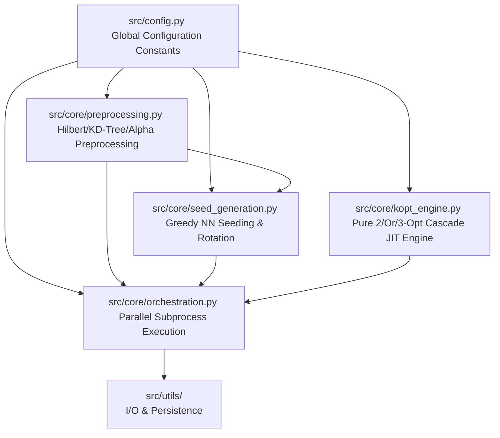

# High-Level Design: Pure Python/Numba TSP Solver

## 1. Introduction

This document defines the High-Level Design (HLD) for the refactored, production-grade Traveling Salesperson Problem (TSP) solver. 

### 1.1 Objectives
*   **100% Pure Python + Numba Architecture**: Eliminate all C++ dependencies and compilation setups, ensuring the solver is lightweight and portable.
*   **High Performance at Scale**: Solve instances up to ~115,000 cities within a 10-minute time budget.
*   **Precision**: Achieve a final tour length within a <5% gap from the Held-Karp (HK) lower bound.
*   **Cleanliness & Maintainability**: Clean up all experimental and duplicate modules (such as `lkh_core.py`), unify settings in a configuration hub, and secure robust concurrent scheduling.

---

## 2. System Architecture

The solver is structured into highly cohesive modules. Computations are vectorized and arrays are shared directly to minimize overhead. 



### 2.1 Component Overview

1.  **Configuration Hub**: [config.py](file:///C:/Users/eric2/Desktop/Classes/Math%20147/TSP_EXP_2/src/config.py)
    *   Holds all hyperparameters as module-level constants.
    *   Treating them as constants allows Numba to perform compile-time optimizations (dead branch elimination, loop unrolling, and inlining), yielding the fastest execution speed.
2.  **Preprocessing & Soft Backbone**: [preprocessing.py](file:///C:/Users/eric2/Desktop/Classes/Math%20147/TSP_EXP_2/src/core/preprocessing.py) & [validation.py](file:///C:/Users/eric2/Desktop/Classes/Math%20147/TSP_EXP_2/src/core/validation.py)
    *   *Hilbert Reordering*: Sorts city coordinates along the space-filling Hilbert curve to group physically close cities in memory, maximizing CPU cache locality.
    *   *KD-Tree Querying*: Constructs candidate neighbor matrices (e.g., $K=64$) using `scipy.spatial.KDTree` in Python, bypassing slow triangulation methods.
    *   *Held-Karp Vector*: Computes the lower bound and the subgradient penalty vector `pi` (1D array) via JIT-accelerated 1-tree relaxation.
    *   *Alpha Refinement*: Evaluates LKH-style edge Alpha values using `pi` and coordinates. Candidate lists are sorted by Alpha values (representing the **Soft Backbone**), prioritizing promising edges for local search.
3.  **Seeding & Reseed**: [seed_generation.py](file:///C:/Users/eric2/Desktop/Classes/Math%20147/TSP_EXP_2/src/core/seed_generation.py)
    *   *Greedy Seeding*: Generates high-quality candidate-guided Nearest Neighbor tours.
    *   *Reseed Rotation*: Implements a 100% Exploit strategy where subsequent runs are seeded by evenly spaced rotated versions of the current global best tour.
4.  **Cascading K-opt Engine**: [kopt_engine.py](file:///C:/Users/eric2/Desktop/Classes/Math%20147/TSP_EXP_2/src/core/kopt_engine.py)
    *   *Strict Cascade*: Sequentially executes **2-opt $\rightarrow$ Or-opt $\rightarrow$ 3-opt** local searches. Operators 4-opt and 5-opt are removed.
    *   *DLB Pruning*: Employs Don't Look Bits to skip unmodified nodes.
    *   *No Hard Locking*: The `locked_edges` array and hard-lock edge constraints are **deprecated and removed** from local search operators, avoiding the worst-case $O(N \cdot k^2)$ proof-of-optimality bottleneck.
5.  **Parallel Orchestrator**: [orchestration.py](file:///C:/Users/eric2/Desktop/Classes/Math%20147/TSP_EXP_2/src/core/orchestration.py)
    *   Uses `multiprocessing.Pool` to run solver seeds in parallel across CPU cores.
    *   Aggregates progress via shared-memory structures (`multiprocessing.Manager`).
    *   Includes wrapper `try-except` blocks inside workers to catch Numba/Python exceptions, preventing subprocess hang-ups.
6.  **I/O & Persistence**: [data_io.py](file:///C:/Users/eric2/Desktop/Classes/Math%20147/TSP_EXP_2/src/utils/data_io.py) & [persistence.py](file:///C:/Users/eric2/Desktop/Classes/Math%20147/TSP_EXP_2/src/utils/persistence.py)
    *   Handles loading of city data and caching of Held-Karp bounds.
    *   *Partial-Run Persistence Safeguard*: Ensures `data/best_tour.csv` is updated **only** during full-scale runs (when the entire dataset is solved), avoiding overwriting the optimal global tour with a subset solution.

---

## 3. Key Design Choices & Rationale

### 3.1 Numba Configuration Binding (Constant Freezing)
*   **Choice**: Define configurations as module-level constants in `src/config.py` and import them directly in `src/core/kopt_engine.py` during compilation.
*   **Rationale**: Passing arguments like `OR_OPT_MAX_LEN` and `BACKBONE_THRESHOLD` down through nested JIT functions adds calling overhead and prevents compiler optimizations. Freezing these constants at import time enables maximum Numba optimization.

### 3.2 Deprecation of Hard Edge Locking (Transition to Pure Soft Backbone)
*   **Choice**: Delete `locked_edges` (hard lock constraints) from JIT local search functions. Remove `src/core/backbone.py` (edge consensus extraction) or mark it deprecated.
*   **Rationale**: Fact-checking shows that locking edges forces the optimization engine to perform exhaustive candidate scans at locked nodes to prove local optimality, transforming average-case searches into worst-case $O(N \cdot k^2)$ operations. At N=115k, this bottleneck exceeds the 10-minute time budget. Instead, we rely entirely on **Held-Karp Alpha-value sorting** to bias the candidate set towards highly probable edges (Soft Backbone), providing pruning without strict constraints.

### 3.3 100% Exploit Rotation Reseeding
*   **Choice**: For an $S$-seed setup (e.g. 8 seeds), generate all initial paths for subsequent iterations by rotating the current global best tour.
*   **Rationale**: By rotating the starting node of the best tour at even intervals (at indices $i \cdot \lfloor N/S \rfloor$), each parallel solver explores a different segment of the neighborhood search space from a high-quality starting state.

### 3.4 Missing I/O Utility Restoration
*   **Choice**: Implement `load_best_length_from_csv` in `src/utils/data_io.py` to parse saved tour lengths.
*   **Rationale**: Restoring this utility fixes broken tests in `tests/test_data_io_extended.py` and provides a robust way to verify persistence integrity.

---

## 4. Interfaces and Data Flow

### 4.1 Global Sequence Flow

#### Initial Run Pipeline
```
[cities.csv] ──> load_cities ──> hilbert_reorder_cities (Reordered Coords)
                                         │
                                         ▼
   refine_candidate_set_with_alpha <── build_candidate_sets (KD-Tree k=64)
                 │
                 ▼ (Top 40 Candidates sorted by Alpha)
       generate_greedy_nn_seeds ──> parallel_solve (Initial Search) ──> Best Tour
```

#### Multi-Iteration Reseed Loop
```
          ┌─────────────────────────────────────────────────────────┐
          ▼                                                         │
  [Current Best Tour] ──> rotate_tour (S evenly spread starts)      │
                               │                                    │
                               ▼                                    │
                         parallel_solve (ILS with kicks) ───────────┘
                               │ (New Best Tour?)
                               ▼
            update_best_tour (Only if is_full_run) ──> [best_tour.csv]
```

### 4.2 Core Data Layouts
*   **Coordinates**: `np.ndarray (shape=(N, 2), dtype=float64)` (Hilbert-reordered).
*   **Candidate Set**: `np.ndarray (shape=(N, K), dtype=int32)` (Alpha-sorted, padding unused neighbors with `-1`).
*   **Tours**: `np.ndarray (shape=(S, N), dtype=int32)` (Indices relative to reordered coordinates).
*   **Alpha Values**: `np.ndarray (shape=(N, K), dtype=float64)`.

---

## 5. Testing & Verification Protocol

1.  **Test Clean-up**:
    *   Delete `tests/test_lkh_core.py` (associated with the deprecated `lkh_core.py` engine).
    *   Fix the missing imports in `tests/test_data_io_extended.py`.
2.  **Execution & Convergence Checks**:
    *   Verify cascading operators (2-opt, Or-opt, and 3-opt) correct cost changes using synthetic coordinate tests.
    *   Run scale-up checks starting at $N=100$, scaling through $N=1,000$ and $N=5,000$ to confirm convergence without stalling.
    *   Validate that full-sample persistence logic functions correctly without writing to `data/best_tour.csv` when $N < 115,475$.
